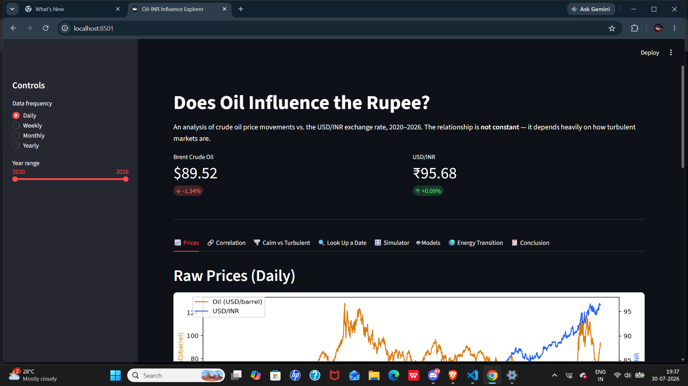
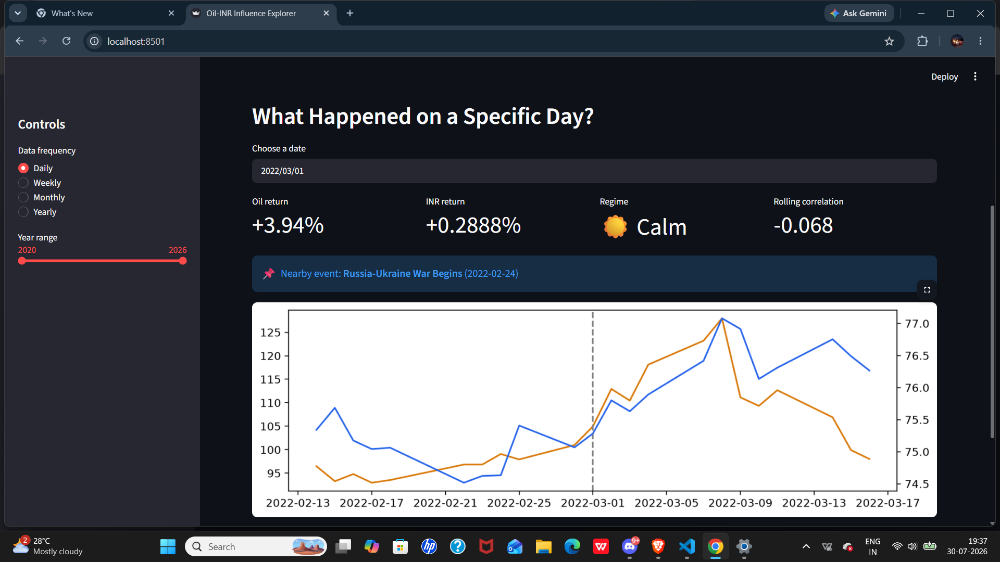
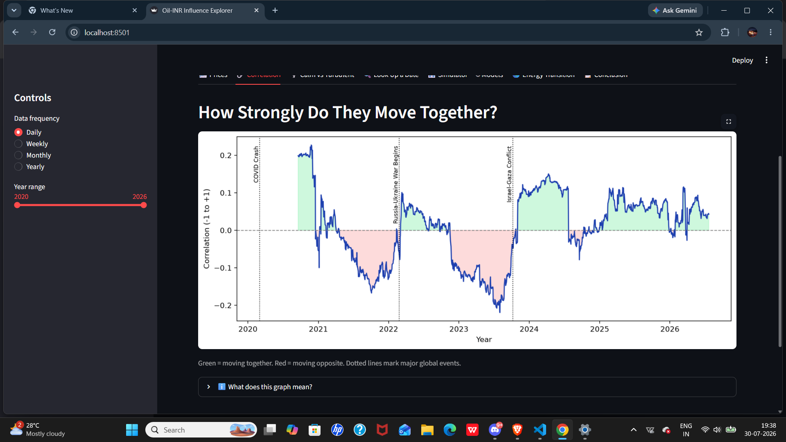
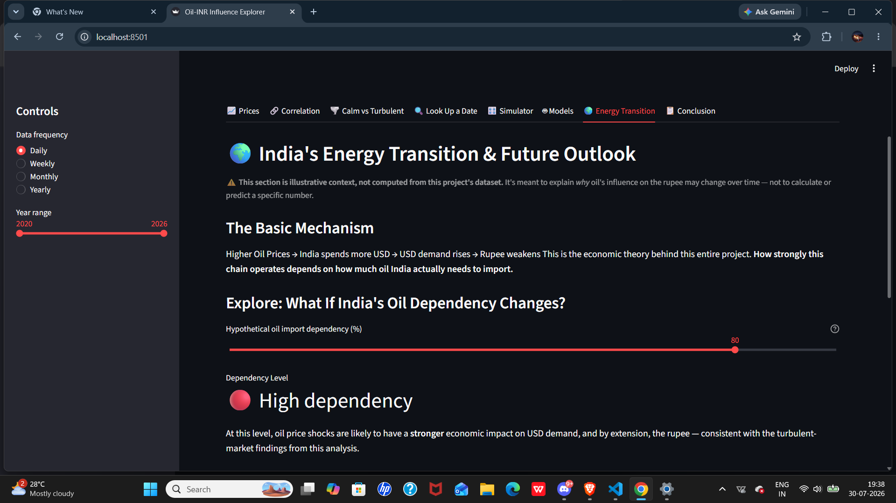

# Does Oil Price Affect the Indian Rupee?


A data science project that looks at real market data (2020–ongoing) to answer a simple question:

**When crude oil prices go up or down, does the Indian Rupee (INR) move too?**

---

## The Answer

**Oil has no measurable influence on the rupee during normal market conditions — but during turbulent, high-volatility periods, a real, statistically significant relationship emerges.**

- On a calm day, knowing what oil did tells you almost nothing about what the rupee will do. The two show no reliable pattern at all.
- During turbulent periods (like a war or an oil price shock), oil and the rupee start moving together consistently, and this shows up clearly in the data, not just as a hunch.

**Bottom line: oil isn't a constant driver of the rupee — it's a stress-period driver.** It goes quiet in calm markets and becomes real when markets are under pressure.

---

## Why This Question Matters

India buys most of its oil from other countries, and pays for it in US dollars. The basic theory is:

```
Oil gets more expensive
        ↓
India needs more US dollars to pay for it
        ↓
More demand for dollars
        ↓
Rupee gets weaker
```

This sounds simple, but real data shows it's much messier than that — which is exactly what this project investigates.

---

## What This Project Actually Did

1. **Pulled real historical data** (2020–ongoing) for:
   - Brent crude oil prices
   - USD/INR exchange rate
   - (Also briefly tested US Dollar Index and India's Nifty 50 stock index)

2. **Checked if oil and rupee move together**, using statistics (correlation) — found the relationship was weak on its own.

3. **Tried predicting the rupee's daily movement using oil prices**, using two machine learning models (Linear Regression and Random Forest) — both performed poorly, meaning oil alone isn't a reliable predictor.

4. **Tested different time frames** — daily, weekly, monthly, yearly — to see if the relationship got clearer at any of them. It didn't improve meaningfully at any frequency.

5. **The key discovery**: instead of treating the relationship as "always weak," the project split the data into **calm market days** vs. **turbulent market days** (based on how much oil prices were swinging around). This revealed:
   - **Calm days:** no real relationship between oil and rupee at all.
   - **Turbulent days:** a real, statistically meaningful relationship — oil and rupee move together far more reliably.

6. **Built an interactive dashboard** to explore all of this visually — see below.

---

## Honest Limitations (Things This Project Does NOT Claim)

- **This is not a forecasting tool.** It does not predict tomorrow's rupee value. It explains a historical pattern.
- **Oil might not be a real "cause" of rupee movement at all.** Both oil and the rupee may simply be reacting to the same global shocks (wars, crises) at the same time — not oil directly causing rupee changes.
- **Small sample sizes limit some findings.** At monthly and yearly time frames, there isn't enough data to draw firm conclusions.
- **India's oil dependence is changing.** As India adopts more EVs, ethanol blending (E20/E100), and renewable energy, oil may matter less to the rupee in the future. This project doesn't have the data to measure that yet — it's a reasonable expectation, not a proven result.

---

## The Interactive Dashboard

A live dashboard was built to explore all of this without needing to read code or understand statistics. It includes:

- 📈 Live oil and rupee prices
- 🔗 A chart showing how the oil-rupee relationship has changed over time
- 🌪️ A clear comparison of calm vs. turbulent market periods
- 🔍 A tool to look up what happened on any specific date
- 🎛️ A simulator showing what historically tended to happen after a given oil price move
- 🤖 A comparison of the two machine learning models tried
- 🌍 A section explaining how India's shift away from oil might change this relationship in the future
- 📋 A plain-language summary of all findings

## Dashboard Preview

### Home


### Date Lookup


### Volatility Analysis


### Energy Transition


---

## How to Run This Yourself

**Requirements:** Python 3.10 or newer

1. Clone or download this repository
2. Open a terminal in the project folder
3. Create and activate a virtual environment:
   ```
   python -m venv venv
   venv\Scripts\activate      # Windows
   source venv/bin/activate   # Mac/Linux
   ```
4. Install the required packages:
   ```
   pip install pandas numpy yfinance matplotlib scipy scikit-learn streamlit
   ```
5. Run the dashboard:
   ```
   streamlit run Interface.py
   ```
6. It will open automatically in your browser at `http://localhost:8501`

---

## Tools Used

- **Python** — the programming language
- **pandas / numpy** — for organizing and calculating with data
- **yfinance** — for pulling real, free financial data
- **scikit-learn** — for the machine learning models
- **matplotlib** — for charts
- **Streamlit** — for the interactive dashboard

---

## A Note on This Project

This was built as a learning project to apply machine learning and statistics to a real, meaningful question — not as a financial tool for making real investment or trading decisions. Every finding here is reported honestly, including the times the data didn't show what was originally expected. That's part of the point: good data science means reporting what the data actually says, not just what you hoped to find.s
